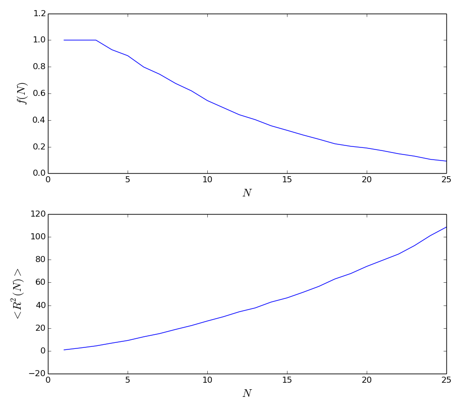
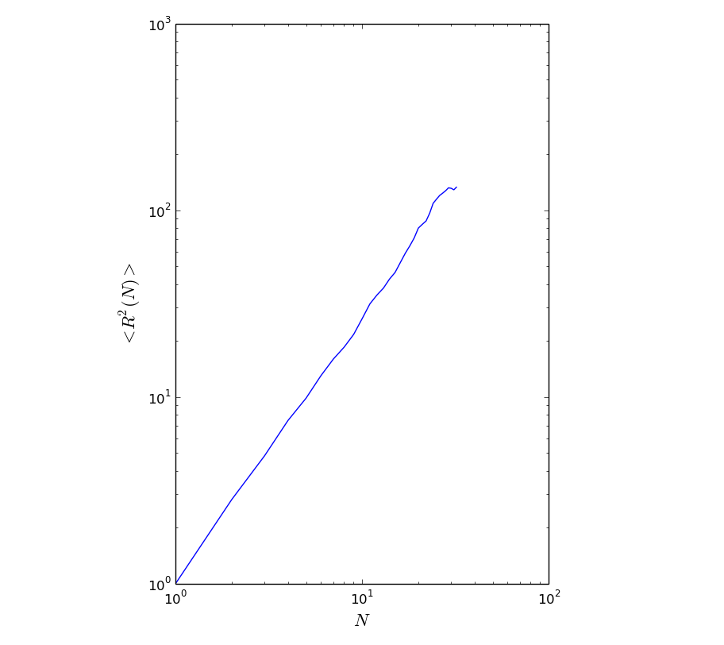

.. _12-12-label:

====================================================
問題12.12 - 2次元自己回避型ランダムウォーク
====================================================

.. contents::

シミュレーションの目的
====================================================

溶媒中の高分子を特徴づける基本的な幾何学的量は両端間の距離の2乗平均\ :math:`<R^{2}(N)>`\ である。ここで\ :math:`N`\ は単量体の数である。高分子鎖の希薄溶液では、\ :math:`<R^{2}(N)>`\ の漸近的依存性は

.. math:: <\Delta R^{2}(N)> \sim N^{2\nu}\ \ \ \ (N \gg 1)
    :label: 12-12-e1

で与えられ、指数\ :math:`\nu`\ は3次元の場合\ :math:`\nu \simeq 0.592`\ である。また、以下で議論する高分子のモデルでは、2次元の場合は正確に\ :math:`\nu=3/4`\ であることが知られている。式\ :eq:`12-12-e1`\ の比例定数は単量体の構造や溶媒による。それに対して、指数\ :math:`\nu`\ はこれらの詳細にはよらない。

ここで溶媒中の鎖状高分子の全体的な特徴を取り込んだランダムウォークのモデルについて考える。高分子鎖を格子上に置き(図12.3b参照)、単量体どうしの相互作用を無視すると、この簡単なランダムウォークのモデルは、次元や格子の対称性にはよらず、\ :math:`\nu=1/2`\ を与える。しかしながら、この\ :math:`\nu`\ の値は実験とは一致しないので、高分子の重要な物理的性質を見落としていることがわかる。そこで、高分子の重要な特徴である、2個の単量体が空間の同じ位置を占有することができない(排除体積条件)という点を考慮に入れた、より現実的なモデルを考えよう。自己回避型ランダムウォーク(SAW)は、曲がる高分子鎖についてこの拘束条件を取り込んだ、よく知られたモデルの1つである。原点から出発し、どの格子点も2度以上は訪れないという拘束条件に従う\ :math:`N`\ 歩のランダムウォーク全体の集合を考える。問題12.12では2次元自己回避型ランダムウォークのモンテカルロ・シミュレーションを扱う。

作成したプログラム
====================================================

本シミュレーションで作成したプログラムを以下に示す。

2次元自己回避型ランダムウォークのシミュレーション実行ファイル
-------------------------------------------------------------------------------

プログラムの内容について、簡単な解説をつけておく。

このプログラムは主に1つのクラスと4つの関数から構成され、このクラスSAWが今回のシミュレーションで特に重要な部分である。他の関数、例えば115行目のplot_graphは、グラフを1つのウィンドウに複数並べて配置するための汎用的な関数であり、この関数内の変数はmatplotlib.pyplot内の変数以外には依存していない。また、151行目のif節以降の関数ex_a,ex_b,ex_b_fitはそれぞれ問題a、bで用いる関数である(ex_b_fitは\ :math:`\nu`\ の計算に用いる)。

クラスSAWは初期化関数の他にself_avoiding_rw_d2、self_avoiding_rw_Rosenbluthという2つの関数を含む。これらの関数はそれぞれ問題a、bで考える、異なったアルゴリズムの2次元自己回避型ランダムウォークをシミュレートするものである。2つの関数で共通のものとして配列latticeがある。これは2次元の配列であり、ブール値を保持して、Trueのときそこには単量体が存在すると見なす。行方向を\ :math:`x`\ 、列方向を\ :math:`y`\ とする。

次に、時間発展ごとにどのような処理を行うかについて説明を加えると、self_avoiding_rw_d2では1つ前の座標を(_x,_y)で保持し、現在の位置との差をとってベクトルにし、これをvecとする。次の遷移の方向はvecの向きから見て、前・右・左の3種類であり、乱数を用いてこの中から等確率で選ぶようにする。もしすでにその位置に粒子があるとき(49行)、新しいループを開始する。そうでなければその位置に単量体を置いてこの時の両端間距離\ :math:`R^{2}_{m}(n)`\ (\ :math:`m`\ :m番目の高分子鎖、\ :math:`n`\ :n個目の単量体)を記録する。active_walkersによって、Nステップまで高分子鎖を作ることができた数をカウントし、これによってN個の高分子鎖をつくることができる割合\ :math:`f(N)`\ を求める。また、\ :math:`R^{2}(N)`\ の平均値を求めるとき、そのNまで高分子鎖を作ることができたものだけで平均をとるためにも、active_walkersを用いている。

self_avoiding_rw_Rosenbluthでは、リストpathの中に可能な(つまり空白サイトの)座標を記録し、その数によって場合分けを行う。問題bに示されているように、これが0ならループを終了、1ならその点に移動して\ :math:`W[n]=(1/3)W[n-1]`\ とし、2なら等確率で移動して\ :math:`W[n] = (2/3)W[n-1]`\ とする。可能なパスが3つあるとき同様に等確率で移動し、\ :math:`W[n] = W[n-1]`\ とする。1ステップごとに\ :math:`R^{2}`\ を計算し、保存する。全てのwalkerについての計算が終了したら、

.. math:: <R^{2}(N)> = \frac{\sum_{i}W_{i}(N)R^{2}_{i}(N)}{\sum_{i}W_{i}(N)}

の式を用いて\ :math:`<R^{2}(N)>`\ を計算する。

* 12-12_self_avoiding_rw.py(\ :download:`download <12-12_self_avoiding_rw.py>`\ )

.. literalinclude:: 12-12_self_avoiding_rw.py
    :language: python
    :linenos:

実習課題
====================================================

* 正方格子上の自己回避型ランダムウォークを考える。任意の格子点を選んで、そこを原点とし、第1歩を”上向き”にとる。他の3方向の第1歩から生成される自己回避型ランダムウォークは、単に全体を回転させるだけなので、それらを別に考える必要はない。原点に戻ることができないという拘束条件から、第2歩では3方向が可能である。乱数を生成して3方向からその1つを選び、引き続く各ステップも同様にして生成する。しかし通常はその歩行(ランダムウォーク)は無限には続かない。注意すべき点は、偏りのない結果を得るために、1歩あるいはそれ以上の歩数の後に自己交差を生じてしまう場合でも、同様に乱数(たとえば1,2,3)を生成しなければならないことである。次のステップで自己交差が起こるときには、統計性を正しく保つためにその歩行は停止しなければならない。そして新しい歩行を再び原点から始める。この簡単なアルゴリズムを実現するプログラムを書いて、\ :math:`N`\ 個の単量体からなる高分子鎖を生成することができた回数の割合\ :math:`f(N)`\ を記録せよ。すでに訪れた格子点を記録するために、格子点を2次元配列で表すと都合がよい。\ :math:`f(N)`\ の定性的な\ :math:`N`\ 依存性はどうなるか。適当と考えられる\ :math:`N`\ の最大値はどれほどか。それらの\ :math:`N`\ の値について両端間の距離の2乗平均の値\ :math:`<R^{2}(N)>`\ を求めよ。    

上に示したプログラムを用いて、\ :math:`N`\ 個の単量体からなる高分子鎖を生成することができた回数の割合\ :math:`f(N)`\ と、両端間の距離の2乗平均の値\ :math:`<R^{2}(N)>`\ を求め、横軸\ :math:`N`\ として\ :num:`図#fig-12-12-f1`\ に示した。この図から分かるように、\ :math:`f(N)`\ は\ :math:`N>3`\ で、\ :math:`N`\ の増加に対して指数関数的に減少していることが分かる。そこで、適当と考えられる\ :math:`N`\ の最大値は、\ :math:`f(N)`\ の大きさがほぼ0となる\ :math:`N=50`\ 程度であるとしてよいだろう。次に、\ :math:`<R^{2}(N)>`\ の値についてグラフを観察すると、この曲線を直線に近似することはできず、また、これまで得られたような2乗に比例するようなグラフよりは”なだらか”である。したがって、\ :math:`\nu`\ は\ :math:`1/2 <\nu< 1`\ を満たす値であると分かる。

.. _fig-12-12-f1:

    
    \ :math:`N`\ 個の単量体からなる高分子鎖を生成することができた回数の割合\ :math:`f(N)`\ と、両端間の距離の2乗平均の値\ :math:`<R^{2}(N)>`\ 

* 設問aで用いた単純な標本抽出法の欠点は、長い鎖では全く効率がよくないこと、つまり成功する確率の割合が指数関数的に減少することである。この非効率を解決するために、いくつかの”強化法”が考案されている。最初に、ローゼンブルスとローゼンブルス(Rosenbluth and Rosenbluth)が提案した、\ :math:`N`\ 歩からなる各歩行に重み関数\ :math:`W(N)`\ を関連づけた比較的簡単な方法について議論しよう。第1歩を北向きに取ることは常に可能なので\ :math:`W(1)=1`\ である。\ :math:`N`\ 歩のすべての可能な配置を同等に数えるために、\ :math:`N>1`\ での\ :math:`W(N)`\ は次の可能性にしたがって決定される。

    1. 可能な3通りのステップすべてで自己交差の拘束条件が破られる場合。重みを\ :math:`W(N)=0`\ として歩行は終了し、原点から出発する新しい歩行が生成される。
    2. 3通りのステップが可能な場合、\ :math:`W(N)=W(N-1)`\ とする。
    3. \ :math:`m`\ (\ :math:`1 \le m < 3`\ )個のステップだけが可能な場合。この場合には\ :math:`W(N)=(m/3)W(N-1)`\ とし、乱数を生成して可能な\ :math:`m`\ 通りのステップの中から1つを選ぶ。

\ :math:`<R^{2}(N)>`\ の正しい値は、\ :math:`i`\ 番目の試行で得られた\ :math:`R^{2}(N)`\ の値\ :math:`R^{2}_{i}(N)`\ にその歩行の重み\ :math:`W_{i}(N)`\ をつけて得られる。したがって

.. math:: <R^{2}(N)> = \frac{\sum_{i}W_{i}(N)R^{2}_{i}(N)}{\sum_{i}W_{i}(N)}

と書くことができる。ここで和はすべての試行についてとられる。ローゼンブルスの方法をモンテカルロ法のプログラムに取り入れて、\ :math:`N=4,8,16,32`\ について\ :math:`<R^{2}(N)>`\ を計算せよ。そして、\ :math:`<R^{2}(N)>`\ の\ :math:`N`\ に対する両対数プロットから指数\ :math:`\nu`\ を求めよ。その\ :math:`\nu`\ の値はランダムウォークの値\ :math:`\nu=1/2`\ と区別することができるか。

* ローゼンブルスの方法を取り入れて、\ :math:`N=4,8,16,32`\ について\ :math:`<R^{2}(N)>`\ を計算し、その結果を\ :ref:`表1 <tab-1>`\ に示した。また、\ :math:`<R^{2}(N)>`\ の\ :math:`N`\ に対する両対数プロットを\ :num:`図#fig-12-12-f2`\ に示した。このグラフから読み取れることとして、\ :math:`<R^{2}(N)>`\ は\ :math:`N`\ のベキ乗に比例しており、そしてグラフの傾きは1よりも大きいので、指数\ :math:`\nu`\ を求めると、その値は単純なランダムウォークのときの値\ :math:`\nu=1/2`\ よりも大きくなることが予想される。実際に100回の試行から\ :math:`\nu`\ を求めると、\ :math:`\nu = 0.732232182648 \pm 0.000938990585164`\ となった。これは単純なランダムウォークの値\ :math:`\nu=1/2`\ と区別できる。

.. _tab-1:

.. csv-table:: ローゼンブルスの方法で求めた\ :math:`<R^{2}(N)>`\ 

    N ,  \ :math:`<R^{2}(N)>`\  
    4, 6.38406
    8, 17.0735
    16, 50.2673
    32, 143.723 

.. _fig-12-12-f2:

    
    \ :math:`<R^{2}(N)>`\ の\ :math:`N`\ に対する両対数プロット

まとめ
====================================================

自己回避型ランダムウォークのモンテカルロ・シミュレーションを行い、両端間の距離の2乗平均\ :math:`<R^{2}(n)>`\ の値が単純なランダムウォークのときの値\ :math:`1/2`\ と区別できることを確かめた。

参考文献
====================================================

* ハーベイ・ゴールド,ジャン・トボチニク,石川正勝・宮島佐介訳『計算物理学入門』,ピアソン・エデュケーション, 2000.
